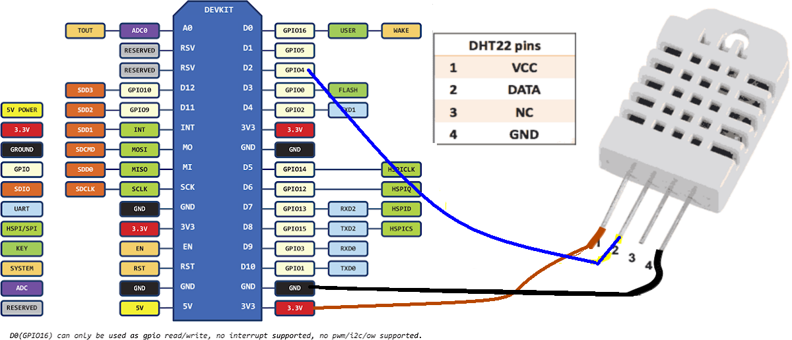

## 使用nodemcu+DHT22 采集温湿度, 并通过wifi发送

特点：

* 成本低 20-40元
* 灵活，简单写lua程序

购买链接：

主控芯片：

* [ESP8266 Lua WIFI V3](https://item.taobao.com/item.htm?id=531755241333) 15.40元

温度传感器可二选一（DHT 11误差大）:

* [DHT 11](https://item.taobao.com/item.htm?id=19526179299) 5.00元
* [DHT 22](https://item.taobao.com/item.htm?id=551955065907) 19.80元

外加手机淘汰的USB线和充电器就可以工作。

连线图：

参考网页：

https://tiestvangool.ghost.io/2016/09/04/capturing-sensor-data-dht22/
https://gist.github.com/thomo/bb539bb7d5b5f2398a62c7d6ef1231b4

