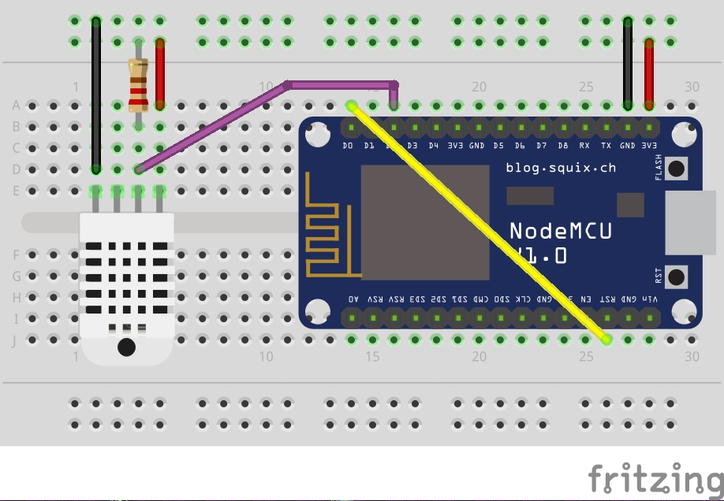

## 使用nodemcu+DHT22 采集温湿度, 并通过http协议发送



https://tiestvangool.ghost.io/2016/09/04/capturing-sensor-data-dht22/
https://gist.github.com/thomo/bb539bb7d5b5f2398a62c7d6ef1231b4


File config.lua
```
--[[
config.lua | Tiest van Gool

Global variables definitions for usage across various lua scripts
--]]

--wifi module
wifi_ssid = "ustcnet"
wifi_password = ""
http_url = "http://202.38.64.40/upload_temp_humi.php"
temp_humi = ""
count = 0

FLOAT_FIRMWARE = (1/3) > 0

--dht module
dht_pin = 2  -- Pin for DHT22 sensor (GPIO4)
-- dht_pin = 3 -- GPIO0
-- dht_pin = 4 -- GPIO2

-- Status Message
print("Global variables loaded")

```

File: init.lua 
```
--[[
init.lua | Tiest van Gool

Init.lua is automatically executed on bootup of the NodeMCU. This launcher file loads the actual init_XYZ file only when everything has been tested and debugged. 
A 15 second delay has been added in case of error and enable abort.
--]]


-- Set local variable
FileToExecute="dht22.lua"

-- Set timer to abort initialization of actual program
print("You have 15 second to enter file.remove('init.lua') to abort")
tmr.alarm(0, 15000, 0, function()
  print("Executing: ".. FileToExecute)
  dofile(FileToExecute)
end)
```


File dht22.lua
```
--[[
dht22.lua | Tiest van Gool
Script connects to internet through NodeMCU wifi module.
Once connection is established dht module and temperature and humidity is retrieved.
--]]

-- Load global user-defined variables
dofile("config.lua")

-- Connect to the wifi network using wifi module
wifi.setmode(wifi.STATION)
wifi.sta.config(wifi_ssid, wifi_password)
wifi.sta.autoconnect(1)
wifi.sta.connect()

-- Read out DHT22 sensor using dht module
function func_read_dht()
  status, temp, humi, temp_dec, humi_dec = dht.read(2)
  if( status == dht.OK ) then
    if FLOAT_FIRMWARE then
      -- Float firmware using this example
      print(string.format("DHT Temperature: %.1f - Humidity: %.1f",temp, humi))
      temp_humi = string.format("temp=%.1f&humi=%.1f",temp,humi)
      print(temp_humi)
    else
      -- Integer firmware using this example
      print(string.format("DHT Temperature:%d.%03d - Humidity:%d.%03d",
        temp,temp_dec,humi,humi_dec))
      temp_humi = string.format("temp=%d.%03d&humi=%d.%03d",temp, temp_dec, humi, humi_dec)
      print(temp_humi)
    end
    count ++
    if( count == 10 ) then
      count = 0
      print("try to send")
      if wifi.sta.status() == 5 then  --STA_GOTIP
         print("Connected to "..wifi.sta.getip())
         url=http_url .. "?mac=" .. wifi.sta.getmac().. "&" .. temp_humi
         print(url)
         http.get(url, nil, function(code, data)
           if (code < 0) then
             print("HTTP request failed")
           else
             print(code, data)
           end
         end)
      else
         print("wifi still connecting...")
      end
    end
  elseif( dht_status == dht.ERROR_CHECKSUM ) then          
    print( "DHT Checksum error" )
  elseif( dht_status == dht.ERROR_TIMEOUT ) then
    print( "DHT Time out" )
  end
end

tmr.alarm(1,2500,tmr.ALARM_AUTO,func_read_dht)
```
